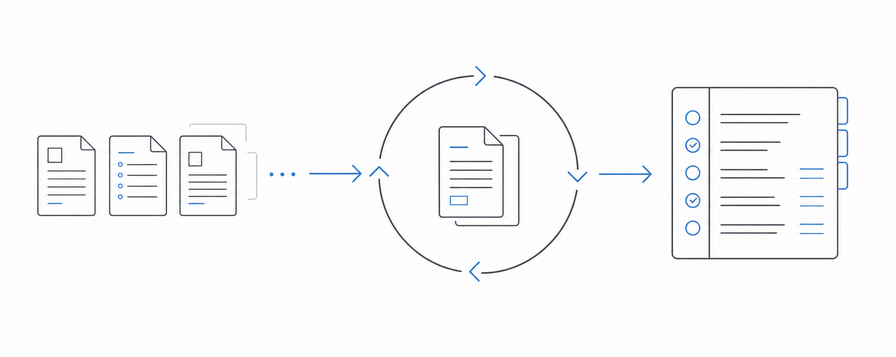
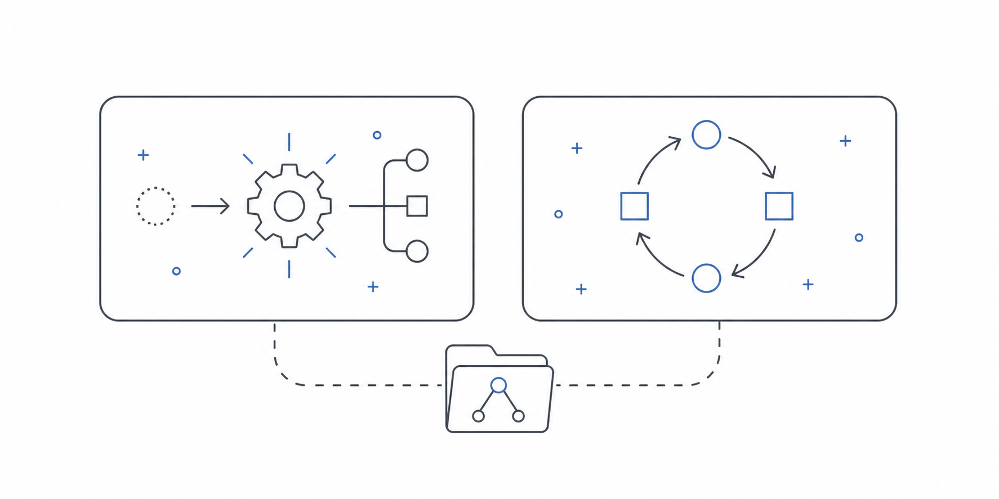
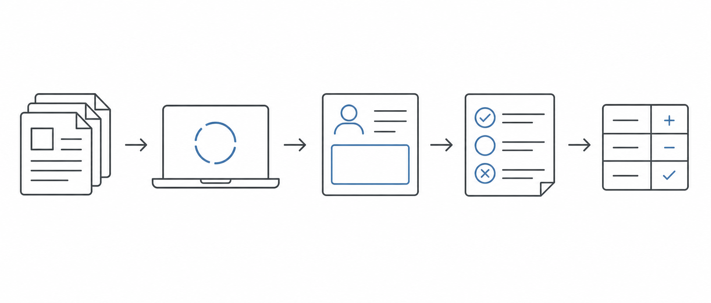

# Document Study Loop



Add slides, course documents, notes, practice exams, and exam rubrics; initialize the agent; then work through Markdown practice runs generated from that material. Each run is graded with scores and topic statuses, so you revise weak areas, close completed topics, open new ones, and repeat.

A lightweight template for file-based study with agents.

The repo is intentionally blank by default. Clone it, give an agent the setup prompt, add your own local source documents, and start a new loop.

## Instant Setup

Template repository: [https://github.com/olafBobryk/document-study-loop](https://github.com/olafBobryk/document-study-loop)

### First-Time Bootstrap

Copy this prompt into Codex or another coding agent when you have not cloned the template yet:

**Create a new Document Study Loop from `https://github.com/olafBobryk/document-study-loop`. Clone the template into a new local folder, then read `AGENTS.md` and `skills/document-study-loop-setup/SKILL.md`. Set up a Git-safe local study workflow for my documents. Keep raw PDFs, slide decks, archives, secrets, and local editor state out of Git. Use Markdown run files in `exam-revision/runs/active/`, preserve answers when grading, update the study ledger, and treat `examples/` as reference material only.**

Equivalent shell-first setup:

```sh
git clone https://github.com/olafBobryk/document-study-loop.git my-study-loop
cd my-study-loop
```

### Already Cloned

**Set up this repository as a new Document Study Loop. Read `AGENTS.md` and `skills/document-study-loop-setup/SKILL.md` first. Create a Git-safe local study workflow for my documents. Keep raw PDFs, slide decks, archives, secrets, and local editor state out of Git. Use Markdown run files in `exam-revision/runs/active/`, preserve answers when grading, update the study ledger, and treat `examples/` as reference material only.**

### Continue Existing Loop

**Continue this existing Document Study Loop. Read `AGENTS.md` and `skills/document-study-loop-continue/SKILL.md` first. Summarize the current active runs, completed runs, source maps, and study ledgers. If an answer sheet is ready, grade it in place; otherwise propose the next Markdown run. Do not treat `examples/` as live study state.**

## Recommended Editor

Use [Visual Studio Code](https://code.visualstudio.com/) for the intended Markdown file workflow. The template includes VS Code extension recommendations and a lightweight profile seed at `vscode-profiles/chatgpt-study/chatgpt-study.code-profile`.

Shared profile:

- [Open the ChatGPT Study Loop profile import page](https://vscode.dev/editor/profile/github/c6997f0e6d8dee7b9d7be6d868520532)
- [Review the source profile Gist](https://gist.github.com/olafBobryk/c6997f0e6d8dee7b9d7be6d868520532) if you want to inspect the profile file. The Gist page is source code only and has no import button.

When the profile import page opens in `vscode.dev`, choose `Import Profile in Visual Studio Code` to open the desktop import flow, then confirm `Import Profile`. If you stay in the web editor, use the cloud/download buttons to install the listed extensions there.

Recommended extensions:

- [Markdown Preview Enhanced](https://marketplace.visualstudio.com/items?itemName=shd101wyy.markdown-preview-enhanced)
- [Markdown All in One](https://marketplace.visualstudio.com/items?itemName=yzhang.markdown-all-in-one)
- [Markdown Editor](https://marketplace.visualstudio.com/items?itemName=zaaack.markdown-editor)
- [vscode-pdf](https://marketplace.visualstudio.com/items?itemName=tomoki1207.pdf)
- [Office Viewer](https://marketplace.visualstudio.com/items?itemName=cweijan.vscode-office)

Local fallback: open VS Code and run `Profiles: Import Profile...`, then select `vscode-profiles/chatgpt-study/chatgpt-study.code-profile`.

## Included Skills



This template carries two local skills for agents:

- `skills/document-study-loop-setup/SKILL.md` sets up a blank loop, migrates an existing study folder, audits Git safety, and prepares the repo for GitHub.
- `skills/document-study-loop-continue/SKILL.md` resumes work in an existing loop, checks current state, grades ready runs, or proposes the next run.

The setup skill creates the durable structure. The continue skill prevents new chats from starting over or accidentally using example files as live study state.

## Loop Breakdown



The workflow stays file-based instead of turning into a long chat quiz:

1. Put source documents in `exam-revision/source/` locally. Raw source documents are ignored by Git.
2. Let an agent build or update `exam-revision/notes/topic_source_map.md` and `exam-revision/notes/exam_question_patterns.md`.
3. Let an agent create a Markdown run in `exam-revision/runs/active/`.
4. Answer directly under each `Answer` heading.
5. Ask the agent to grade the run in place, update `study-ledgers/study-loop-ledger.md`, and move the graded run to `exam-revision/runs/completed/`.

Generated practice should usually be altered variants grounded in your documents. Exact original sample questions should only be used when you explicitly request a final-check or calibration pass.

## Repository Layout

```text
.
├── AGENTS.md
├── NEW_CHAT_INIT_PROMPT.md
├── assets/
├── exam-revision/
│   ├── notes/
│   ├── runs/
│   │   ├── active/
│   │   ├── completed/
│   │   └── _templates/
│   ├── source/
│   ├── transcripts/
│   └── diagrams/
├── examples/
│   └── tue-2irr00-software-design/
├── skills/
│   ├── document-study-loop-setup/
│   └── document-study-loop-continue/
└── study-ledgers/
```

## Public Safety

This repo is designed to be public-template safe. Do not commit raw PDFs, slide decks, sample exams, archives, secrets, or local editor state. Keep those files local and let agents reference them through source maps, summaries, transcripts you are allowed to publish, or local-only paths.

The `examples/` folder shows the shape of a real loop without publishing source course files or full transcripts.

## Example

See `examples/tue-2irr00-software-design/` for a compact example based on a TU/e 2IRR00 Software Design study loop. It includes a tiny source map, a tiny ledger, and one answered-and-graded run. It is example-only and should not be used as live study state.
